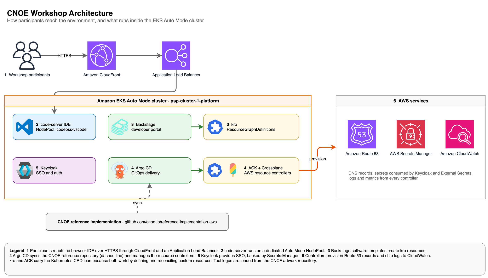
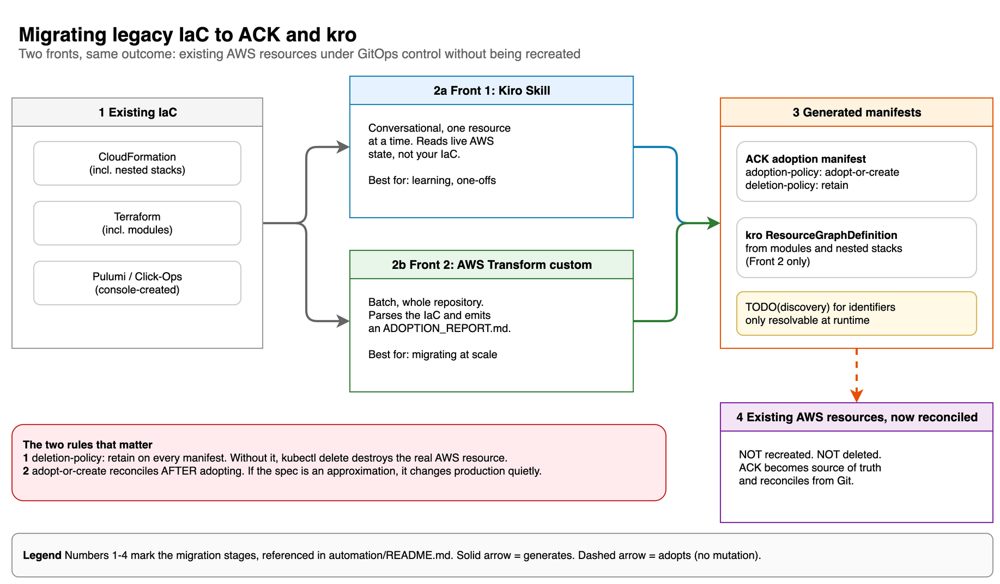

# Platform Engineering Foundations on AWS

Infrastructure templates, hands-on lab manifests, and automation assets for building Internal
Developer Platforms (IDPs) on Amazon EKS.

**Amazon EKS Auto Mode · EKS Capabilities (Argo CD, kro, ACK) · Crossplane · Backstage · CNOE**

> **This is sample code, for non-production usage.** You should work with your security and legal
> teams to meet your organizational security, regulatory and compliance requirements before
> deployment. The environment ships **demo-grade defaults** that are deliberate teaching choices,
> not recommendations: read [Security and Hardening](#security-and-hardening) before you reuse any
> of it.

### There is a workshop that walks through this code

This repository is the **code**. The guided, step-by-step content lives in a separate workshop:

**[Platform Engineering Foundations on AWS](https://studio.us-east-1.prod.workshops.aws/workshops/7dfe6b37-0fe8-403e-8ab4-e1c56baea092)**

If you landed here first, start there: it walks the labs in order and explains the reasoning behind
each step. This repository is what the workshop clones and applies.

## Table of Contents

- [Overview](#overview)
- [The Problem](#the-problem)
- [What You Will Build](#what-you-will-build)
- [Repository Structure](#repository-structure)
- [Getting Started](#getting-started)
- [Labs](#labs)
- [Optional Module: Migrating Legacy IaC](#optional-module-migrating-legacy-iac)
- [Going Further: Fleet Management](#going-further-fleet-management)
- [Cost](#cost)
- [Cleanup](#cleanup)
- [Troubleshooting](#troubleshooting)
- [Known Limitations](#known-limitations)
- [Security and Hardening](#security-and-hardening)
- [Documentation and References](#documentation-and-references)

## Overview

This repository holds the **code** used by the *Platform Engineering Foundations on AWS* workshop.
You can consume it two ways:

- **Guided** - follow the workshop on AWS Workshop Studio, which walks through each lab in order:
  [Platform Engineering Foundations on AWS](https://studio.us-east-1.prod.workshops.aws/workshops/7dfe6b37-0fe8-403e-8ab4-e1c56baea092)
- **Standalone** - deploy the CloudFormation stacks in your own account and work through the labs
  from this repository at your own pace.

Everything runs in a single AWS account.

## The Problem

Platform teams are asked to give developers self-service infrastructure without handing them the
whole AWS API. Three questions decide whether that works:

- **Where do platform controllers run, and what can they reach?** Controllers hold broad IAM
  permissions and cluster-scoped CRDs. Running them alongside application workloads entangles blast
  radius with permission boundaries.
- **How much abstraction is the right amount?** Every abstraction you add removes a choice from your
  users. Each removal has to buy them something real.
- **What do you do with what already exists?** A greenfield platform is a demo. A real one inherits
  hundreds of resources created by CloudFormation, Terraform, and the console.

The labs work through all three, in that order.

## What You Will Build

![Three-cluster topology. Three VPCs side by side, each with its CIDR - VPC 1 at 10.0.0.0/16 with cluster-1-platform running the EKS Capabilities and Backstage, VPC 2 at 10.1.0.0/16 with cluster-2-cnoe-diy running the CNOE reference stack, VPC 3 at 10.2.0.0/16 with cluster-3-apps running application workloads. Each VPC has two public and two private subnets with a NAT gateway and an internet gateway, every cluster runs EKS Auto Mode, and dashed arrows show the full mesh of VPC peering, and a row of technology icons inside each VPC - Argo CD, kro, Backstage and Amazon Bedrock in VPC 1; Argo CD, CNOE, Backstage and Crossplane in VPC 2; Kubernetes Deployments and Services in VPC 3.](docs/images/three-cluster-topology.png)

*Figure 1: Three-cluster topology. One VPC per cluster with non-overlapping CIDRs, peered in a full
mesh so the platform cluster can provision into a genuinely remote cluster.*

| Cluster | Role |
|---|---|
| `psp-cluster-1-platform` | Platform control plane. EKS Capabilities (Argo CD, kro, ACK), Crossplane, Backstage portal |
| `psp-cluster-2-cnoe-diy` | The CNOE reference implementation, assembled from open source components |
| `psp-cluster-3-apps` | Workload cluster. Receives applications and infrastructure provisioned through the platform APIs |

All three run **Kubernetes 1.35** with **EKS Auto Mode**. There are no managed node groups and no
launch templates anywhere: compute comes from the `general-purpose` and `system` node pools, and
load balancing and block storage are operated by AWS.

Clusters 1 and 2 are deliberately two answers to the same question. Cluster 1 uses managed EKS
Capabilities, where AWS operates the controllers. Cluster 2 uses the CNOE stack, where you operate
everything. Running both makes the trade-off concrete instead of theoretical.



*Figure 2: Access path and the CNOE stack inside the cluster. Participants reach a pre-authenticated
browser IDE through CloudFront; Backstage drives kro, Argo CD drives ACK, and provisioning reaches
Route 53, Secrets Manager, and CloudWatch.*

See [docs/architecture.md](docs/architecture.md) for the reasoning behind the topology and
[docs/resources-provisioned.md](docs/resources-provisioned.md) for the complete resource inventory.

## Repository Structure

```
.
├── infrastructure/cloudformation/   Environment provisioning
│   ├── psp-workshop-eks.yaml            3 clusters, 3 VPCs, peering, Backstage supporting stack
│   └── psp-workshop-code-editor.yaml    Browser IDE (code-server) with one-click access
│
├── labs/                            Hands-on exercises
│   ├── ack/                             AWS Controllers for Kubernetes
│   ├── kro/                             Kubernetes Resource Orchestrator
│   └── crossplane/                      Compositions and Backstage catalog
│
├── automation/                      Optional module: legacy IaC to ACK and kro
│   ├── iac-to-ack-kiro-skill/           Front 1, conversational
│   └── iac-to-ack-atx-custom/           Front 2, batch via AWS Transform
│
├── docs/
│   ├── architecture.md                  Why the topology looks like this
│   ├── resources-provisioned.md          Complete resource inventory
│   ├── cleanup.md                        Teardown runbook
│   ├── diagrams/                         draw.io sources + the diagram convention
│   └── images/                           Exported figures
│
└── scripts/                         Asset packaging and upload
```

## Getting Started

### Prerequisites

| Requirement | Notes |
|---|---|
| AWS account | Single account. Administrative permissions are required to create IAM roles |
| Region | `us-east-1` is the tested region |
| AWS CLI v2 | Configured with credentials for the target account |
| `kubectl` | Version compatible with Kubernetes 1.35 |
| An S3 bucket for workshop assets | Required by the main stack, see the note below |
| Working knowledge | Kubernetes fundamentals and basic AWS networking |

> **`WorkshopAssetsBucket` has no default.** The main stack loads its Lambda code from S3 rather than
> inline, so the archives must exist before the stack is created. Build and upload them first:
>
> ```bash
> ./scripts/upload-backstage-genai-assets.sh <your-assets-bucket>
> ```
>
> The script validates each handler with `py_compile`, packages it, and uploads it under
> `lambda/`, along with the Backstage build files under `backstage-genai/`. Source lives in
> [`assets/backstage-genai/`](assets/backstage-genai). Two Lambdas are published and both are
> deployed in every environment: `prewarm` and `supported-list-validator`.
> It also syncs [`labs/`](labs) to `ack/`, `kro/` and `crossplane/` in the same bucket, because two
> of the labs have you download their manifests from there rather than from this repository.
> A hosted workshop performs this step for you.

### 1. Clusters, networking, and supporting resources

```bash
aws cloudformation deploy \
  --stack-name psp-workshop-eks \
  --template-file infrastructure/cloudformation/psp-workshop-eks.yaml \
  --s3-bucket <your-assets-bucket> \
  --parameter-overrides \
      WorkshopName=psp \
      WorkshopAssetsBucket=<your-assets-bucket> \
  --capabilities CAPABILITY_NAMED_IAM \
  --region us-east-1
```

Roughly 20 minutes, 100 resources.

> **`--s3-bucket` is required, not optional.** This template is 77 KB and CloudFormation only
> accepts templates up to 51,200 bytes inline, so the CLI has to stage it in S3 first. Reuse the
> same bucket you created for the assets. Without the flag the command fails immediately with
> `Templates with a size greater than 51,200 bytes must be deployed via an S3 Bucket`.

> Keep the stack name `psp-workshop-eks`. The workshop content resolves stack outputs and resource
> tags by that name.

> **Leave `Environment` at its default, `dev`.** The only difference is six EKS Access Entries for
> `WSParticipantRole` and `WSOpsRole`, which exist **only** in an AWS-hosted workshop account.
> Setting `prod` in your own account makes those six resources fail with
> `The specified principalArn is invalid` and rolls the whole stack back. On `dev` the identity that
> creates the clusters keeps implicit admin, which is enough for every lab, and everything else -
> including the Bedrock model validation - is created either way.

### 2. Browser IDE

```bash
aws cloudformation deploy \
  --stack-name psp-workshop-code-editor \
  --template-file infrastructure/cloudformation/psp-workshop-code-editor.yaml \
  --s3-bucket <your-assets-bucket> \
  --capabilities CAPABILITY_NAMED_IAM \
  --region us-east-1
```

This template is 71 KB, so it needs `--s3-bucket` for the same reason as the first one.

The main stack publishes seven SSM parameters (VPC and subnet IDs, cluster names) that this stack
consumes as parameter defaults, so it must run second. Its `IdeUrl` output is a pre-authenticated
CloudFront URL: open it and you land in a code-server session that already has access to all three
clusters.

### Verify

```bash
aws eks list-clusters --region us-east-1
# expected: psp-cluster-1-platform, psp-cluster-2-cnoe-diy, psp-cluster-3-apps

aws eks update-kubeconfig --name psp-cluster-1-platform --region us-east-1
kubectl get nodepools    # general-purpose, system
```

### 3. Lab manifests in the IDE

Two of the labs read their manifests from `~/environment/{ack,kro,crossplane}` in the IDE. Copy them
in once, from a terminal **inside** the IDE:

```bash
BUCKET=<your-assets-bucket>
for d in ack kro crossplane; do
  aws s3 cp "s3://${BUCKET}/${d}/" "$HOME/environment/${d}/" --recursive --quiet
done
```

The other directories the labs use - `custom-templates`, `legacy-iac`, `catalog`, `cnoe` - are
created as you go. `cnoe` in particular must not exist beforehand: you clone it from the in-cluster
Gitea, and a pre-existing directory makes that `git clone` fail.

## Labs

Each lab provisions real AWS resources from Kubernetes at a different level of abstraction. Working
through them in order shows the progression from raw controllers to a curated platform API.

```
ACK           11 manifests, one per AWS resource, ordering is yours to manage
   │
   ▼
kro           1 ResourceGroup authored once, 1 instance manifest consumed by developers
   │
   ▼
Crossplane    a versioned catalogue of compositions, surfaced as Backstage templates
```

### `labs/ack` - AWS Controllers for Kubernetes

Eleven numbered manifests that build a complete serverless application, applied in sequence. The
lowest level of abstraction: one Kubernetes resource per AWS resource, no composition.

```
01-rds-subnet-group      →  05-lambda-security-group   →  09-apigatewayv2-route
02-rds-security-group    →  06-lambda-function         →  10-apigatewayv2-stage
03-rds-instance          →  07-apigatewayv2-api        →  11-s3-frontend-bucket
04-lambda-role           →  08-apigatewayv2-integration
```

The takeaway: ACK gives you full fidelity to the AWS API, and the ordering and wiring are your
responsibility.

### `labs/kro` - Kubernetes Resource Orchestrator

The same application as a single `ResourceGroup` that a developer consumes with one small instance
manifest. Eleven manifests collapse into one, and kro resolves the dependency graph, so the ordering
problem from the ACK lab disappears.

### `labs/crossplane` - Compositions and a Backstage catalog

| Path | Content |
|---|---|
| `setup/`, `scripts/` | Provider installation and helper scripts |
| `basic/` | A first `CompositeResourceDefinition` and matching composition |
| `advanced/crossplane-backstage/configs/` | Provider and function configurations |
| `advanced/workshop-setup/` | The platform catalog |

The catalog lives under `advanced/workshop-setup/platform/backstage/templates/custom-catalog/` and
covers `database/postgresql`, `database/dynamodb`, `cluster/eks-basic`,
`cluster/eks-addon/loadbalancer-controller`, `compute/lambda`, `compute/container`,
`network/basic`, `bucket/webhost`, `bucket/logging`, `frontend/spa`, `app/fullstack`, and
`app/serverless-multi-tier`. Every composition is versioned (`v0.0.1/`) so the catalog can evolve
without breaking existing claims, and each domain ships the `template.yaml` and `skeleton/` that
expose it as a Backstage software template.

## Optional Module: Migrating Legacy IaC

The labs build platform APIs on a clean environment. This module addresses what you actually walk
into: resources that already exist, created by other tooling, which need to come under Kubernetes
and GitOps control **without being recreated**.



*Figure 3: The migration, offered as two fronts. Both emit the same artefact shape and both enforce
`adopt-or-create` with `deletion-policy: retain`.*

| Front | Delivery |
|---|---|
| [`automation/iac-to-ack-kiro-skill`](automation/iac-to-ack-kiro-skill) | Conversational, one resource at a time. Reads live AWS state |
| [`automation/iac-to-ack-atx-custom`](automation/iac-to-ack-atx-custom) | Batch across a whole repository via the AWS Transform CLI, emitting kro `ResourceGraphDefinition`s for modules and nested stacks |

Do one resource by hand with the Kiro Skill first: adoption has a failure mode that is easy to hit
and hard to diagnose from a batch report. See [automation/README.md](automation/README.md) for
prerequisites and the two rules that separate a migration from an outage.

## Going Further: Fleet Management

The labs stop at managing resources from a cluster. The layer above is managing **clusters** the
same way: the EKS cluster itself becomes a resource with an API, a management cluster provisions
and bootstraps workload clusters, Argo CD registers them automatically, and Kargo promotes an
application across the fleet.

That material is a separate AWS sample, and it is not duplicated here. Clone it on its own:

```bash
git clone https://github.com/aws-samples/fleet-management-on-amazon-eks-workshop.git
cd fleet-management-on-amazon-eks-workshop/patterns/kro-eks-cluster-mgmt
cat README.md
```

It is a **separate environment**, with its own IDE stack, Terraform, and GitLab, and it costs
materially more than this workshop: hub plus four spokes across two regions means five EKS control
planes and five VPCs. Deploy it in a fresh account, not on top of the three clusters from these
labs, and read its README first: the prerequisites and the deploy order are its own.

> Its `patterns/kro-eks-cluster-mgmt/` directory is the entry point; the rest of the repository
> covers other patterns you do not need for this.

## Cost

Cost is driven by resources that bill per hour whether or not you are using them.

| Component | Quantity | Billing model |
|---|---|---|
| EKS cluster (control plane) | 3 | Per cluster-hour |
| NAT Gateway | 3 | Per hour, plus data processing per GB |
| Application Load Balancer | 2 | Per hour, plus LCU |
| EKS Auto Mode compute | Varies with the labs | EC2 On-Demand plus an Auto Mode management fee |
| IDE instance | 1 `t3.medium` | On-Demand, plus 60 GB gp3 |
| CloudFront, S3, ECR, SSM, Secrets Manager | Low volume | Usage based |

Order of magnitude for a four-hour session in `us-east-1`: a few US dollars. Confirm against the
[AWS Pricing Calculator](https://calculator.aws/) before running with a large group, since three
NAT Gateways and three control planes accrue independently of activity.

The single most effective cost control is deleting the stacks when you finish.

## Cleanup

Order matters. Resources created *by* the clusters during the labs must be removed before the stacks
that own the clusters, otherwise stack deletion stalls on dependencies.

```
1. Crossplane claims, ACK resources, kro instances, Kubernetes ingresses and LoadBalancer Services
2. psp-workshop-code-editor
3. psp-workshop-eks
4. Verify nothing survived
```

Full procedure, including the cases that commonly get stuck, in [docs/cleanup.md](docs/cleanup.md).

## Troubleshooting

| Symptom | Cause | Fix |
|---|---|---|
| `Templates with a size greater than 51,200 bytes must be deployed via an S3 Bucket` | Both templates exceed the inline limit (77 KB and 71 KB), so the CLI must stage them in S3 | Add `--s3-bucket <your-assets-bucket>` to the `deploy` command. Reuse the assets bucket |
| Main stack fails immediately on `WorkshopAssetsBucket` | The parameter has no default and the bucket must already contain the Lambda archives | Create the bucket, run `./scripts/upload-backstage-genai-assets.sh <bucket>`, pass the name with `--parameter-overrides` |
| Changeset creation fails with `AWS::EarlyValidation::ResourceExistenceCheck` after a previous attempt rolled back | Four log groups outlive the rollback, because the Lambda and CodeBuild recreate them as soon as they run. The next deploy is rejected before it starts, on a name that already exists | Delete them and deploy again: `for g in /aws/codebuild/psp-backstage-build /aws/lambda/psp-backstage-build-trigger /aws/lambda/psp-bedrock-prewarm /aws/lambda/psp-supported-list-validator; do aws logs delete-log-group --log-group-name $g; done`. Also delete the `REVIEW_IN_PROGRESS` stack left behind by the failed changeset |
| IDE stack fails resolving its VPC or subnet parameters | It reads SSM parameters published by the main stack. Either the main stack has not finished, or the two stacks were deployed with different `WorkshopName` values | Confirm the main stack is `CREATE_COMPLETE`, then check `aws ssm get-parameter --name /workshop/psp/vpc-1-id` |
| `IdeUrl` opens but the editor is not there yet | Setup runs through SSM State Manager after the stack completes, so the instance answers before code-server is installed | Wait two to three minutes. If it persists, check the State Manager association and the SSM command output bucket |
| `kubectl` cannot reach a cluster from the IDE | Access is granted by `EKS::AccessEntry`, one per cluster | `aws eks update-kubeconfig --name <cluster> --region us-east-1`, then `kubectl auth can-i get pods` |
| No nodes appear when a pod is pending | Auto Mode provisions nodes on demand and a first node takes a minute | `kubectl get nodepools` and `kubectl describe pod` to confirm the scheduling constraint matches a node pool |
| An ACK resource sits with `ACK.Terminal: True` | An invalid or incompatible field in the spec, often a field that changed without an API version bump | `kubectl describe <kind> <name>` and read the condition message. Fix the spec and re-apply |
| An ACK resource sits with `ACK.Recoverable: True` | Transient: throttling, or the controller cannot assume its role | Check the controller logs and the Pod Identity association |
| Crossplane claim stays not ready | Usually the provider cannot authenticate, or a referenced resource has not been created yet | `kubectl get managed` to see what the composition actually created, then check the provider pod logs |
| Backstage portal returns 503 | The pod is not yet registered behind the target group created by CloudFormation | Confirm the `TargetGroupBinding` exists and the pod is `Running` |
| Stack deletion stalls on a VPC | Something the cluster created is still attached, commonly a load balancer from a Kubernetes ingress | Follow [docs/cleanup.md](docs/cleanup.md), which covers ENIs, security group references, and finalizers |

## Known Limitations

| Limitation | Detail |
|---|---|
| Workshop assets must be built before the first deploy | The stack loads Lambda code from S3, so `./scripts/upload-backstage-genai-assets.sh` has to run before `cloudformation deploy`. Source and script are both in the repository, but the ordering is a real constraint |
| `us-east-1` is the only tested region | CloudFront and ACM handling assumes it, and Bedrock model availability for the Backstage GenAI plugin varies by region |
| `Environment=prod` requires an AWS-hosted workshop account | It creates six EKS Access Entries for `WSParticipantRole` and `WSOpsRole`, roles the hosting platform provides. In your own account the default `dev` is correct |
| One NAT Gateway per VPC | A cost choice, not a resilience recommendation. Production designs place one per Availability Zone |
| AWS Transform custom is not in `sa-east-1` | The batch migration front reads code rather than clusters, so set `AWS_REGION=us-east-1` for the transformation even when your workloads run in São Paulo |
| Fleet management lives in another repository | Not duplicated here. See [Going Further](#going-further-fleet-management) |

## Documentation and References

| Document | Content |
|---|---|
| [docs/architecture.md](docs/architecture.md) | Why three clusters, how peering and Auto Mode are configured, stack dependencies |
| [docs/resources-provisioned.md](docs/resources-provisioned.md) | Every resource each template creates, with parameters and outputs |
| [docs/cleanup.md](docs/cleanup.md) | Teardown in order, and the cases that get stuck |
| [docs/diagrams/README.md](docs/diagrams/README.md) | The diagram convention: versioned draw.io sources, the CLI export, and the constraints that keep a figure legible |
| [automation/README.md](automation/README.md) | The optional migration module and its two fronts |
| [scripts/upload-backstage-genai-assets.sh](scripts/upload-backstage-genai-assets.sh) | Packages and uploads the Lambda archives and Backstage build files the main stack consumes |

**External:**
[Amazon EKS](https://docs.aws.amazon.com/eks/) ·
[EKS Auto Mode](https://docs.aws.amazon.com/eks/latest/userguide/automode.html) ·
[kro](https://kro.run/) ·
[ACK](https://aws-controllers-k8s.github.io/community/) ·
[Crossplane](https://docs.crossplane.io/) ·
[Argo CD](https://argo-cd.readthedocs.io/) ·
[Backstage](https://backstage.io/docs/) ·
[CNOE](https://cnoe.io/) ·
[AWS Transform custom](https://docs.aws.amazon.com/transform/latest/userguide/custom-get-started.html)

## Contributing

See [CONTRIBUTING.md](CONTRIBUTING.md). Please open an issue before submitting substantial changes.

## Security and Hardening

This environment is built to **teach**, in a disposable account, for the length of a workshop. Some
of its defaults would be defects in production. They are listed here rather than silently fixed,
because each one exists to make a lesson visible.

| Default | Why it is like that | Before you reuse it |
|---|---|---|
| The `IdeUrl` is **pre-authenticated**: possession of the URL is the entire access control | Participants have to reach a working IDE in one click, with no account setup | Put a real identity provider in front of it. Treat the URL as a short-lived secret and delete the stack when you finish |
| Platform controllers (ACK, Crossplane) hold **broad IAM** via Pod Identity | The labs provision across many services, so a narrow policy would break them mid-exercise | Scope one role per controller to the resources it actually manages. This is the first thing to change |
| The three VPCs are peered in a **full mesh** | So the platform cluster provisions into a genuinely remote cluster, instead of faking it locally | Production segments by blast radius. A mesh means any cluster reaches any other |
| The ACK lab commits Kubernetes `Secret` manifests with placeholder values | A lab needs credentials to exist before the application starts, and a placeholder makes the shape visible | Move them to Secrets Manager or External Secrets. A `Secret` in git is base64, not encryption |
| The ACK lab creates a **public static-site S3 bucket** | The lab needs a reachable frontend to show the provisioning worked end to end | Confirm account-level Block Public Access, and front the bucket with CloudFront and OAC |
| **One NAT Gateway per VPC**, not per AZ | A cost choice for a short session | One per Availability Zone, or you have coupled every private subnet to a single AZ |

None of this is a substitute for your own review. Run your own scanners and threat model against
anything you carry from here into an account that matters.

If you discover a potential security issue, follow the process in
[CONTRIBUTING.md](CONTRIBUTING.md#security-issue-notifications) rather than opening a public issue.

## License

Licensed under the **MIT-0** licence (MIT No Attribution). See [LICENSE](LICENSE) and
[NOTICE](NOTICE).

Everything in this repository is original to it. No third-party code is bundled.
